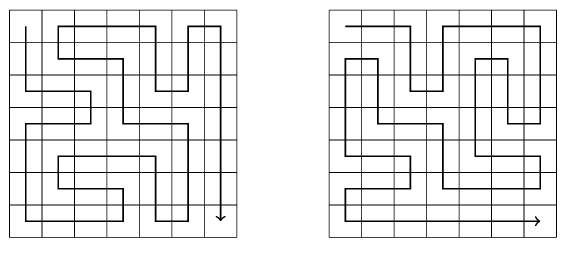
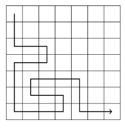
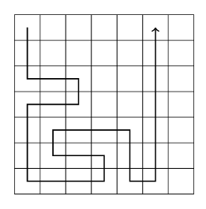

## Podar la Búsqueda

A menudo podemos optimizar el backtracking podando el árbol de búsqueda. La idea es agregar "inteligencia" al algoritmo para que pueda notar lo antes posible si una solución parcial no puede ser extendida a una solución completa. Tales optimizaciones pueden tener un efecto tremendo en la eficiencia de la búsqueda.

Consideremos el problema de calcular el número de caminos en una cuadrícula de *n* x *n* desde la esquina superior izquierda hasta la esquina inferior derecha, de tal manera que el camino visite cada casilla exactamente una vez. Por ejemplo, en una cuadrícula de 7 x 7, hay 111,712 de tales caminos. Uno de los caminos es el siguiente:

Nos enfocamos en el caso de 7 x 7, porque su nivel de dificultad es adecuado para nuestras necesidades. Comenzamos con un algoritmo de backtracking sencillo y luego lo optimizamos paso a paso utilizando observaciones sobre cómo se puede podar la búsqueda. 

Después de cada optimización, medimos el tiempo de ejecución del algoritmo y el número de llamadas recursivas, para que podamos ver claramente el efecto de cada optimización en la eficiencia de la búsqueda.

## Algoritmo Básico

La primera versión del algoritmo no contiene ninguna optimización. Simplemente usamos backtracking para generar todos los posibles caminos desde la esquina superior izquierda hasta la esquina inferior derecha y contamos el número de tales caminos.

- Tiempo de ejecución: 483 segundos
- Número de llamadas recursivas: 76 mil millones

## Optimización 1

En cualquier solución, primero nos movemos un paso hacia abajo o hacia la derecha. Siempre hay dos caminos que son simétricos con respecto a la diagonal de la cuadrícula después del primer paso. Por ejemplo, los siguientes caminos son simétricos:

Por lo tanto, podemos decidir que siempre nos movemos primero un paso hacia abajo (o a la derecha), y finalmente multiplicamos el número de soluciones por dos.

- Tiempo de ejecución: 244 segundos
- Número de llamadas recursivas: 38 mil millones

## Optimización 2

Si el camino llega a la casilla inferior derecha antes de haber visitado todas las demás casillas de la cuadrícula, está claro que no será posible completar la solución. Un ejemplo de esto es el siguiente camino:

Usando esta observación, podemos terminar la búsqueda inmediatamente si llegamos a la casilla inferior derecha demasiado pronto.

- Tiempo de ejecución: 119 segundos
- Número de llamadas recursivas: 20 mil millones

## Optimización 3

Si el camino toca una pared y puede girar hacia la izquierda o hacia la derecha, la cuadrícula se divide en dos partes que contienen casillas no visitadas. Por ejemplo, en la siguiente situación, el camino puede girar hacia la izquierda o hacia la derecha:

En este caso, ya no podemos visitar todas las casillas, por lo que podemos terminar la búsqueda. Esta optimización es muy útil:

- Tiempo de ejecución: 1.8 segundos
- Número de llamadas recursivas: 221 millones

## Optimización 4

La idea de la Optimización 3 se puede generalizar: si el camino no puede continuar hacia adelante pero puede girar hacia la izquierda o hacia la derecha, la cuadrícula se divide en dos partes que ambas contienen casillas no visitadas. Por ejemplo, considera el siguiente camino:

Está claro que ya no podemos visitar todas las casillas, por lo que podemos terminar la búsqueda. Después de esta optimización, la búsqueda es muy eficiente:

- Tiempo de ejecución: 0.6 segundos
- Número de llamadas recursivas: 69 millones

Ahora es un buen momento para detener las optimizaciones y ver lo que hemos logrado. El tiempo de ejecución del algoritmo original era de 483 segundos, y ahora, después de las optimizaciones, el tiempo de ejecución es solo de 0.6 segundos. Por lo tanto, el algoritmo se volvió casi 1000 veces más rápido después de las optimizaciones.

Este es un fenómeno común en el backtracking, ya que el árbol de búsqueda suele ser grande y observaciones simples pueden podar eficazmente la búsqueda. Son especialmente útiles las optimizaciones que ocurren durante los primeros pasos del algoritmo, es decir, en la parte superior del árbol de búsqueda.

## Navegación

- [Anterior: Backtracking.md](./Backtracking.md)
- [Siguiente: Dividir por el medio.md](./Dividir%20por%20el%20medio.md)
